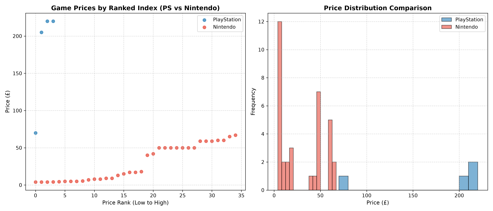

# GamePrice-Index


[](https://github.com/Furkan5E/GamePrice-Index/actions/workflows/test.yaml)

An automated ETL (Extract, Transform, Load) and market intelligence pipeline that scrapes, normalises, and analyses dynamic video game pricing across Nintendo eShop and PlayStation Direct platforms.

---

## Features

* **Hybrid Scraping Architecture:** Combines fast static HTML parsing via `requests` and `BeautifulSoup` with headless `selenium` automation to handle dynamic JavaScript price rendering and pagination.
* **Automated ETL & Historical Tracking:** Cleans currency symbols, standardises product identifiers, calculates pricing differentials via `pandas`, and ingests records into a local `SQLite` database to track price trends over time.
* **Data Visualisation:** Generates analytical scatter and bar plots comparing pricing and discount behaviours across platforms using `matplotlib`.
* **Offline Caching:** Supports cached execution modes (`--cached`) to enable instant data processing and visualisation without re-triggering network requests.
* **Unit Testing:** Includes a suite of automated tests using `pytest` to validate pandas data transformation and normalisation logic.
* **Robust Logging:** Integrated Python `logging` to provide clear, real-time pipeline execution tracking.
* **Containerised Deployment:** Fully containerised using Docker for consistent, environment agnostic execution.

---

## Setup Instructions

Clone the repository and install dependencies using uv:
```bash
git clone https://github.com/Furkan5E/GamePrice-Index.git
cd GamePrice-Index
uv sync
```
Run the live scraping pipeline:
```bash
uv run python -m src.main
```
Run using cached local datasets:
```bash
uv run python -m src.main --cached
```
Run the test suite:
```bash
uv run python -m pytest
```
---
## Docker
Build the Docker image:
```bash
docker build -t gameprice-index .
```
Run the container, maps output files to your local data/ and plots/ directories:
```bash
docker run --rm -v "$(pwd)/data:/app/data" -v "$(pwd)/plots:/app/plots" gameprice-index
```
Pre-built container
```bash
docker run -it --rm -v "${PWD}/data:/app/data" ghcr.io/furkan5e/gameprice-index:latest
```
---
## Analytics & Visualisations

### Price Distribution & Ranked Index


---
## Disclaimer

This tool was developed for educational and portfolio demonstration purposes only. All scraped data is the property of its respective platform holders.
